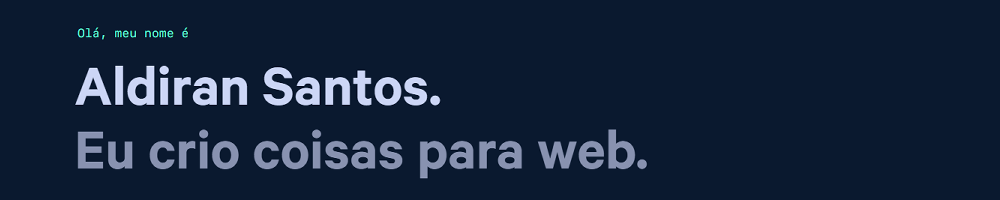

        
        
        
    

## Work Experience

-   👨‍💻 **Frontend Developer & UI Designer**\
    📆 Oct 2023 - Actually\
    📍 <a href="https://www.visual.com.br/" target="_blank"><b>Visual Sistemas</b></a> - Remote\
    \
    🛠️ **Skills**
    

        
        
        
        
        
        
        
    

-   👨‍💻 **Frontend Developer**\
    📆 Aug 2019 - Mar 2021\
    📍 <a href="https://zoop.com.br/" target="_blank"><b>Zoop</b></a> - Rio de Janeiro/RJ, Brazil\
    \
    🛠️ **Skills**
    

        
        
        
        
        
        
        
        
        
        
        
        
        
        
        
    

     

-   👨‍💻 **Frontend Developer**\
    📆 2019 | **Freelancer**\
    📍 <a href="https://www.varilux.com.br/desafio-varilux/" target="_blank"><b>Desafio Varilux</b></a> - Rio de Janeio/RJ, Brazil\
    \
    🛠️ **Skills**
    

        
        
        
        
        
    

     

-   👨‍💻 **Web Developer**\
    📆 Sep 2018 - Feb 2019\
    📍 <a href="https://kitutor.com.br/" target="_blank"><b>Kitutor</b></a> - Rio de Janeiro/RJ, Brazil\
    \
    🛠️ **Skills**
    

        
        
        
        
        
        
    

     

-   👨‍💻 **Frontend Developer**\
    📆 Apr 2017 - Sep 2018\
    📍 <a href="https://site.medgrupo.com.br/#/" target="_blank"><b>MEDGRUPO</b></a> - Rio de Janeiro/RJ, Brazil\
    \
    🛠️ **Skills**
    

        
        
        
        
        
        
        
        
    

     

-   👨‍💻 **Couse Instructor**\
    📆 Feb 2016 - Jun 2016\
    📍 <a href="https://www.microlins.com.br/" target="_blank"><b>Microlins</b></a> - Arapiraca/AL, Brazil\
    \
    🛠️ **Skills**
    

        
        
        
        
        
    

-   👨‍💻 **Frontend Developer**\
    📆 2015 - 2016 | **Freelancer**\
    📍 <a href="https://fau.ufal.br/evento/pluris2016/" target="_blank"><b>Pluris 2016</b></a> - Arapiraca/AL, Brazil\
    \
    🛠️ **Skills**
    

        
        
                
        
    

## Education

📖 **Bachelor's Degree in Computer Science**\
📆 **2011 - 2016**\
 📍 **Federal University of Alagoas** - Arapiraca/AL, Brazil

## Courses

<table align="center">
    <tr>
        <td align="center" width="50%">
            <h3 align="center">Vue.js 2 Course</h3>
            <table>
                <tr>
                    <td width="33.3%">
                        <b>Plataform Course:</b> <a href="https://origamid.com/">Origamid</a>
                    </td>
                </tr>
                <tr>
                    <td width="33.3%">
                        <b>Total hours:</b> 44 hours
                    </td>
                </tr>
                <tr>
                    <td align="center" width="33.3%">
                        <a href="https://www.origamid.com/certificate/5517b315" target="_blank"><b target="_blank">Certificate</b></a>
                    </td>
                </tr>
            </table>
        </td>
        <td align="center" width="50%">
            <h3 align="center">WordPress REST API</h3>
            <table>
                <tr>
                    <td width="33.3%">
                        <b>Plataform Course:</b> <a href="https://origamid.com/">Origamid</a>
                    </td>
                </tr>
                <tr>
                    <td width="33.3%">
                        <b>Total hours:</b> 4 hours
                    </td>
                </tr>
                <tr>
                    <td align="center" width="33.3%">
                        <a href="https://www.origamid.com/certificate/dfbc73ae" target="_blank"><b target="_blank">Certificate</b></a>
                    </td>
                </tr>
            </table>
        </td>
    </tr>
    <tr>
        <td align="center" width="50%">
            <h3 align="center">React Course</h3>
            <table>
                <tr>
                    <td width="33.3%">
                        <b>Plataform Course:</b> <a href="https://origamid.com/">Origamid</a>
                    </td>
                </tr>
                <tr>
                    <td width="33.3%">
                        <b>Total hours:</b> 36 hours
                    </td>
                </tr>
                <tr>
                    <td align="center" width="33.3%">
                        <a href="https://origamid.com/certificate/1f6d6ff8" target="_blank"><b target="_blank">Certificate</b></a>
                    </td>
                </tr>
            </table>
        </td>
        <td align="center" width="50%">
            <h3 align="center">JavaScript ES6 Course</h3>
            <table>
                <tr>
                    <td width="33.3%">
                        <b>Plataform Course:</b> <a href="https://origamid.com/">Origamid</a>
                    </td>
                </tr>
                <tr>
                    <td width="33.3%">
                        <b>Total hours:</b> 74 hours
                    </td>
                </tr>
                <tr>
                    <td align="center" width="33.3%">
                        <a href="https://origamid.com/certificate/3507a5ea" target="_blank"><b target="_blank">Certificate</b></a>
                    </td>
                </tr>
            </table>
        </td>
    </tr>
    <tr>
        <td align="center" width="50%">
            <h3 align="center">UI Design for Beginners</h3>
            <table>
                <tr>
                    <td width="33.3%">
                        <b>Plataform Course:</b> <a href="https://origamid.com/">Origamid</a>
                    </td>
                </tr>
                <tr>
                    <td width="33.3%">
                        <b>Total hours:</b> 34 hours
                    </td>
                </tr>
                <tr>
                    <td align="center" width="33.3%">
                        <a href="https://origamid.com/certificate/388aaefb" target="_blank"><b target="_blank">Certificate</b></a>
                    </td>
                </tr>
            </table>
        </td>
        <td align="center" width="50%">
            <h3 align="center">Responsive Web Design</h3>
            <table>
                <tr>
                    <td width="33.3%">
                        <b>Plataform Course:</b> <a href="https://www.freecodecamp.org/">freeCodeCamp</a>
                    </td>
                </tr>
                <tr>
                    <td width="33.3%">
                        <b>Total hours:</b> 300 hours
                    </td>
                </tr>
                <tr>
                    <td align="center" width="33.3%">
                        <a href="https://freecodecamp.org/certification/aldiransantos/responsive-web-design" target="_blank"><b>Certificate</b></a>
                    </td>
                </tr>
            </table>
        </td>
    </tr>
</table>

## Hard Skills

    
    
    
    
    
    
    
    
    
    

## Soft Skills

- Good interpersonal relationship for teamwork  
- Responsibility and autonomy to carry out work  
- Ability to plan and organize to meet deadlines  
- Emotional intelligence to deal with daily challenges
