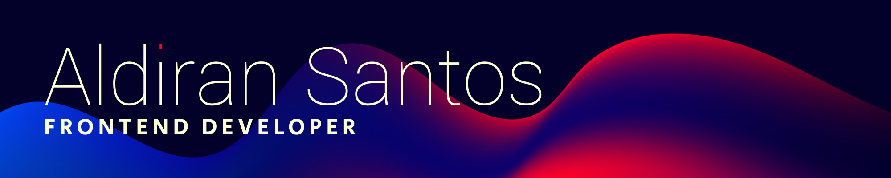

    
      
    
      
    
      
    

  
📃 RESUME

## Education

-   📖 **Bachelor of Computer Science**\
    📆 2011 - 2016\
    📍 **Federal University of Alagoas** - Arapiraca/AL, Brazil

    ### Courses

<table>
  <tr>
    <td valign="top" width="33.3%">
      <h3 align="center"><a href="https://origamid.com/certificate/1f6d6ff8" target="_blank">React Course</a></h3>
      <a href="https://origamid.com/certificate/1f6d6ff8">Origamid</a>
      
36 hours

    </td>
    <td valign="top" width="33.3%">
      <h3 align="center"><a href="https://origamid.com/certificate/1f6d6ff8" target="_blank">React Course</a></h3>
      <a href="https://origamid.com/certificate/1f6d6ff8">Origamid</a>
      
36 hours

    </td>
    <td valign="top" width="33.3%">
      <h3 align="center"><a href="https://origamid.com/certificate/1f6d6ff8" target="_blank">React Course</a></h3>
      <a href="https://origamid.com/certificate/1f6d6ff8">Origamid</a>
      
36 hours

        <tr>
            <td valign="top" width="33.3%">
            <h3 align="center"><a href="https://origamid.com/certificate/1f6d6ff8" target="_blank">React Course</a></h3>
            <a href="https://origamid.com/certificate/1f6d6ff8">Origamid</a>
            
36 hours

            </td>
            <td valign="top" width="33.3%">
            <h3 align="center"><a href="https://origamid.com/certificate/1f6d6ff8" target="_blank">React Course</a></h3>
            <a href="https://origamid.com/certificate/1f6d6ff8">Origamid</a>
            
36 hours

            </td>
            <td valign="top" width="33.3%">
            <h3 align="center"><a href="https://origamid.com/certificate/1f6d6ff8" target="_blank">React Course</a></h3>
            <a href="https://origamid.com/certificate/1f6d6ff8">Origamid</a>
            
36 hours

            </td>
        </tr>
    </td>
  </tr>
</table>
     

## Work Experience

-   👨‍💻 **Frontend Developer**\
    📆 Aug 2019 - Mar 2021\
    📍 **Zoop** - Rio de Janeiro/RJ, Brazil\
    🛠️ **Skills**
    

        
        
        
        
        
        
        
        
        
        
        
        
        
        
        
        
    

     

-   👨‍💻 **Frontend Developer**\
    📆 Sep 2018 - Feb 2019\
    📍 **Kiutor** - Rio de Janeiro/RJ, Brazil\
    🛠️ **Skills**
    

        
        
        
        
        
        
    

     

-   👨‍💻 **Frontend Developer**\
    📆 Apr 2017 - Sep 2018\
    📍 **MEDGRUPO** - Rio de Janeiro/RJ, Brazil\
    🛠️ **Skills**
    

        
        
        
        
        
        
    

     

-   👨‍💻 **Instrutor de Curso**\
    📆 Feb 2016 - Jun 2016\
    📍 **Microlins Franchising** - Arapiraca/AL, Brazil\
    🛠️ **Skills**
    

        
        
        
        
        
    

## HARD SKILLS

✔️ HTML, CSS, Bootstrap\
✔️ JavaScript ES6+, React, Redux\
✔️ WordPress, SEO\
✔️ UX/UI Design, Figma\
✔️ Scrum, Kanban\
✔️ Intermediate English

## SOFT SKILLS

✔️ Good interpersonal relationship for teamwork\
✔️ Responsibility and autonomy to carry out work\
✔️ Ability to plan and organize to meet deadlines\
✔️ Emotional intelligence to deal with daily challenges
